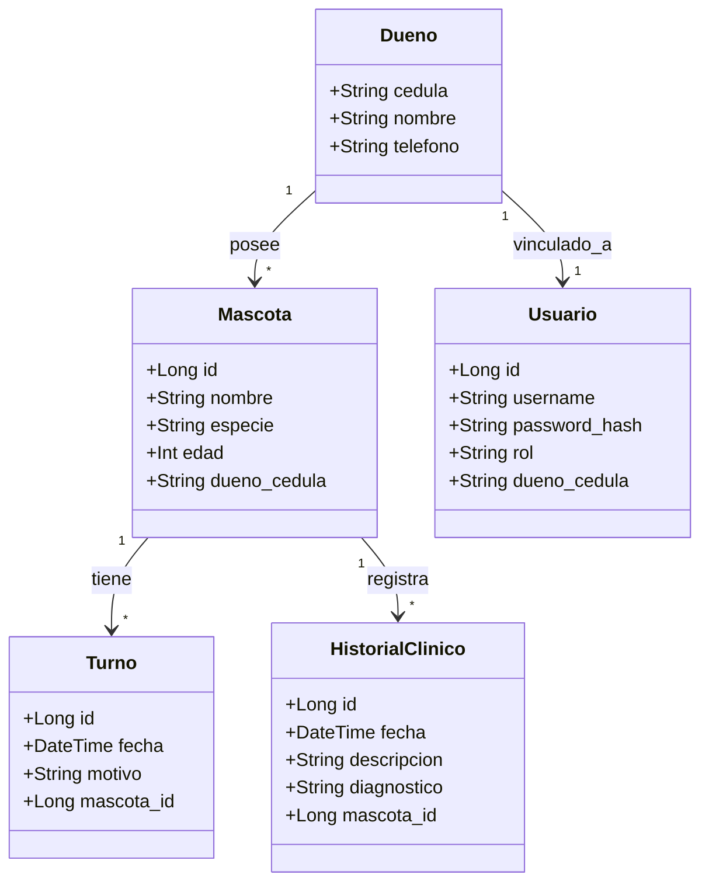
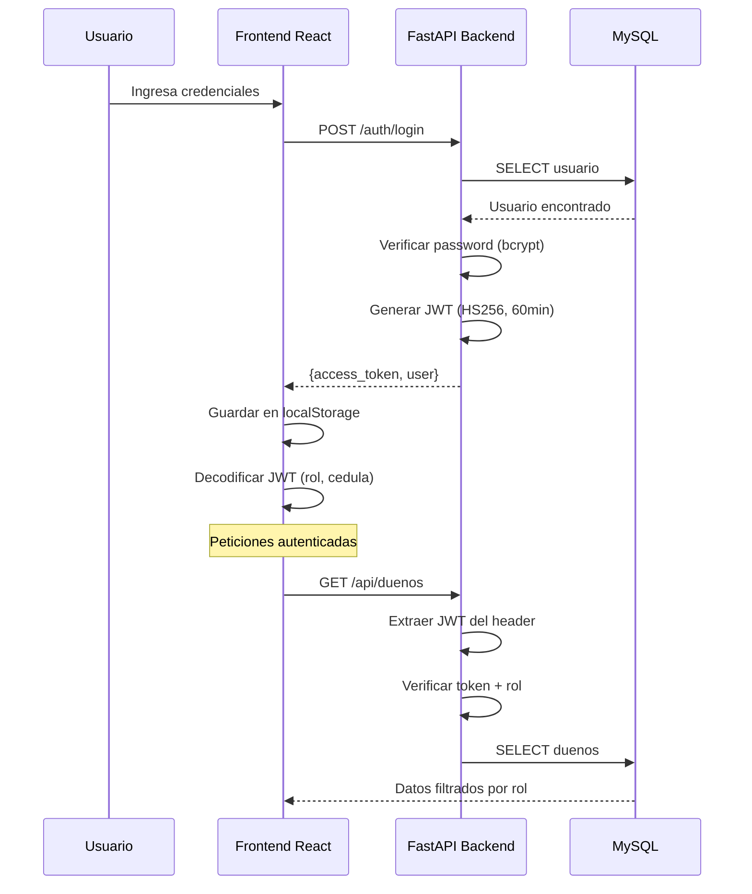
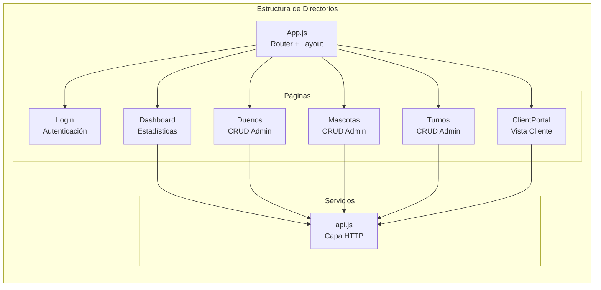
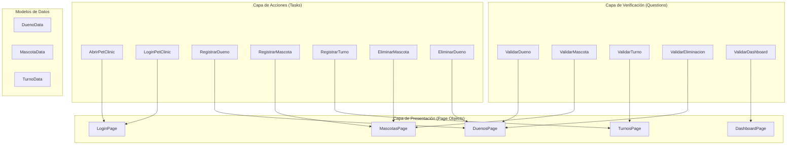
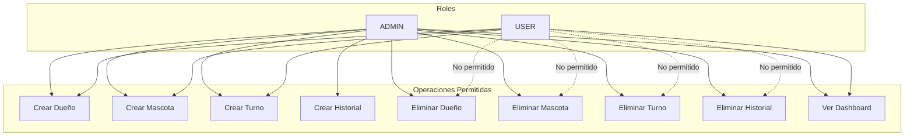

# Arquitectura del Sistema PetClinic

## Diagrama de Arquitectura General

```mermaid
graph TB
    subgraph "Capa de Presentación"
        FW[Frontend Web<br/>React 19 + React Router]
        AM[App Móvil<br/>Carpeta vacía - Pendiente]
    end

    subgraph "Capa de Backend"
        subgraph "API REST (Activa)"
            FA[FastAPI<br/>Python]
            subgraph "Seguridad"
                JWT[JWT Auth]
                RBAC[Role-Based Access<br/>ADMIN / USER]
            end
            subgraph "Endpoints"
                AUTH[/auth/*<br/>login, register]
                DUENOS[/api/duenos<br/>CRUD]
                MASCOTAS[/api/mascotas<br/>CRUD]
                TURNOS[/api/turnos<br/>CRUD]
                HIST[/api/historiales<br/>CRUD]
                DASH[/api/dashboard<br/>stats]
            end
        end
        subgraph "API Secundaria (Incompleta)"
            SB[Spring Boot<br/>Java 17]
            SVC[Service Layer<br/>Vacío]
        end
    end

    subgraph "Capa de Datos"
        MySQL[(MySQL<br/>veterinaria)]
    end

    subgraph "Testing"
        JUNIT[JUnit 5<br/>Backend Tests]
        AUTOM[Serenity BDD + Cucumber<br/>E2E Tests]
    end

    FW --> FA
    FA --> MySQL
    SB -.-> MySQL
    AUTOM --> FW
    JUNIT --> SB
```

## Modelo de Dominio (Diagrama de Clases)



## Flujo de Autenticación



## Arquitectura del Frontend React



## Arquitectura de Automatización (Serenity BDD)



## Capas de Seguridad



## Resumen de Tecnologías

| Componente | Tecnología | Estado |
|------------|------------|--------|
| **Backend Principal** | Python FastAPI | ✅ Activo |
| **Backend Secundario** | Java Spring Boot | ⚠️ Incompleto |
| **Frontend Web** | React 19 | ✅ Activo |
| **Base de Datos** | MySQL | ✅ Activo |
| **Automatización** | Serenity BDD + Cucumber | ✅ Activo |
| **Autenticación** | JWT (HS256) | ✅ Implementado |
| **Testing Backend** | JUnit 5 | ✅ Configurado |
| **App Móvil** | - | ❌ Pendiente |
